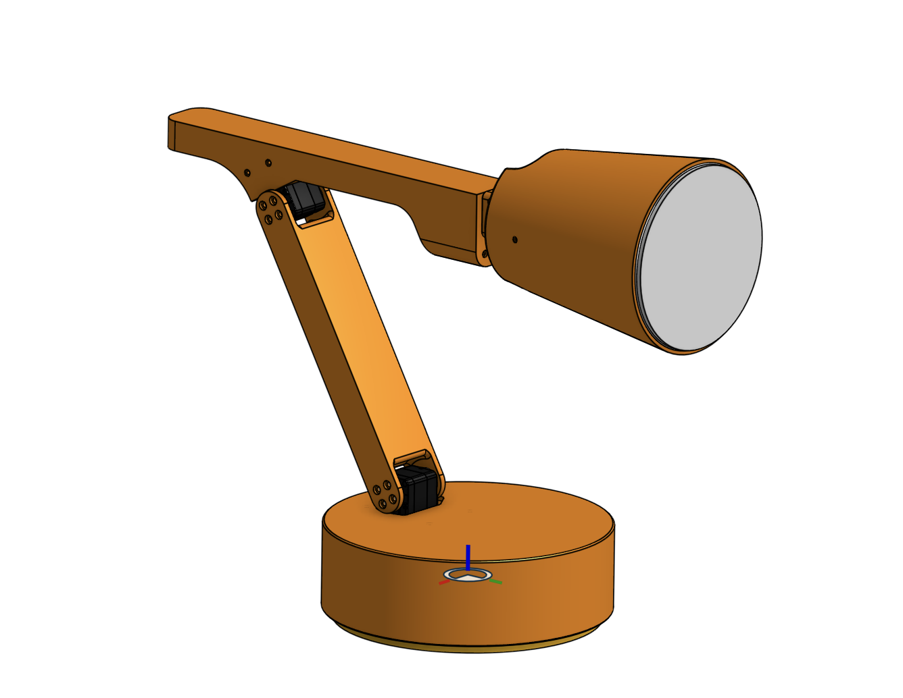

# Components Overview

This page is a work in progress. You will get all the context you need if you continue to page 2.

## 3D Printed Parts

...

<!-- - **1x Lamp Base**: Contains servo driver and a normal pi.
- **1x Lamp Base Cover**: Cover lamp base.
- **1x LampArm (Base to Elbow)**: Contains base pitch and elbow pitch servo.
- **1x LampArm (Elbow to Wrist)**: Contains elbow pitch and wrist roll servo.
- **2x LampArm (Pitch)**: Contains base pitch or wrist pitch servo.
- **1x Lamp Head**: Contains led matrix and speaker.
- **1x Lamp Head - Diffuser**: Diffuse LED Matrix. -->

## Electronic Parts

...

---

**Previous**: [Prerequesites](./0.%20Prerequisites.md) | **Next**: [Electronics](./2.%20Electronics.md)
