# 🛠️ LeLamp Assembly Guide

**⏱️ Estimated time:** 1–2 hours
**🔧 Required tools:** Soldering iron, screwdrivers, heat insert tool  
**📦 Required components:** Raspberry Pi, ReSpeaker Hat, speaker, LED Matrix, SD card, servo driver

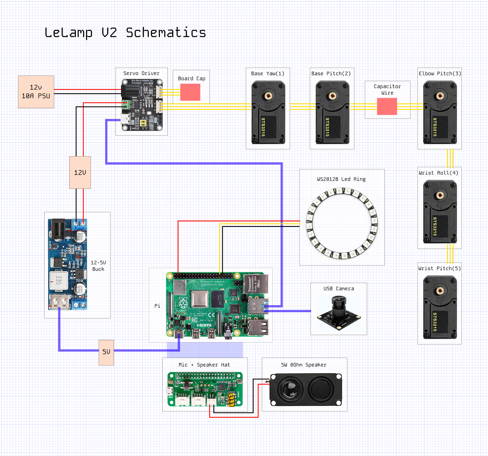

## Overview

LeLamp consists of three main sections: the **Head**, the **Base**, and the **Body**, each containing essential functional components.

### LeLamp Head

- **LED Matrix** — WS2812B programmable LEDs for expression

### LeLamp Base

- **Raspberry Pi with ReSpeaker Hat** — Controls servos, audio, and LEDs
- **Motor Driver** — Drives the servo motors

### LeLamp Body

- **Motors** - Actuators of the Lamp
- **Speaker** — 4 Ω / 3 W audio output

There will be a power, data and ground cable routed all the way to the head for the LEDs, along with a usb cable for the camera.

## Soldering and Assembly

### 1. Assembling the LeLamp Base

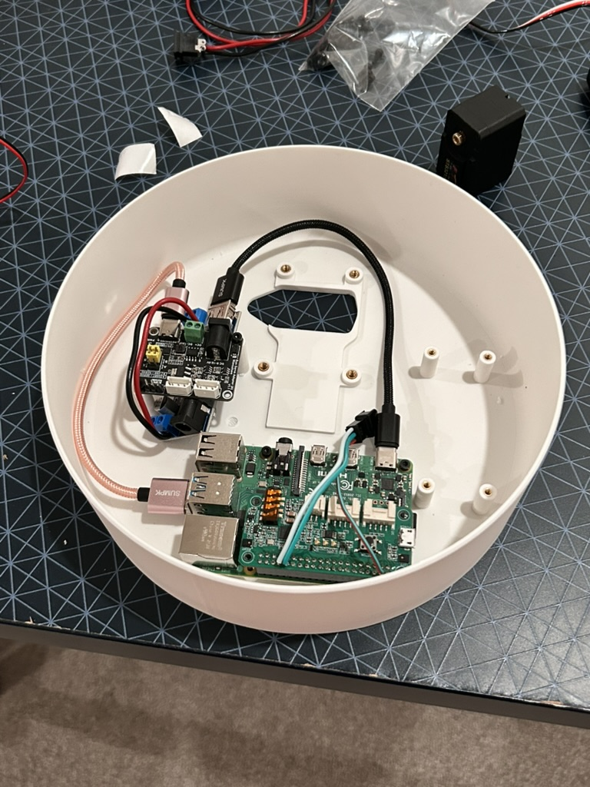

1. **Place inserts on electronics mounts**
   - Put down M2.5 heatset inserts on the **tall** electronics mounts
   - Put down M3 heatset inserts where the servos are mounted (the **short** mounts in the middle)
1. **Mount the electronics:**
   - Secure the **motor driver board** and **Raspberry Pi** inside the base as shown above with M2.5 screws (8mm).
   - Fit the **12V-5V stepdown board** snugly underneath the motor driver board (no mounts for this one, sorry)
   - The last **tall** mounts can be used for the speaker
   - The **short** mounts is for the base core (which contains two motors)
1. **Connect the boards:**

   - Use a **USB Type-C cable** to connect the motor driver to the Raspberry Pi (see image above)
   - Connect the stepdown board with a **USB Type-C cable** to the Raspberry Pi (see image above)
   - Connect the stepdown board from the screw terminal (next to the barrel connector) to the motor driver board's green screw terminal
     Look for the +/- signs on the screw terminals to determine the positive and negative connections (positive to positive, negative to negative)

1. **Prepare the ReSpeaker Hat:**

   - Solder the **header pins** on the ReSpeaker Hat as shown in the image.

   

1. **Connect the ReSpeaker Hat as shown in below image**
   

1. **Assemble the base core**

   (a) Put in the Base Pitch Actuator (ID-2) from the top and fasten it down with M2 screws

   (b) Plug in both wires that go into the Base Yaw actuator (ID-1) and route one of the wires through the hole on the side. Then push the Base Yaw actuator (ID-1) into the slot while pulling the routed cable taut and holding the other cable flat against the body of the actuator. You have to remove the rotor plate for this.

   (c) Connect the routed wire to the base pitch actuator (ID-2)

   <table>
   <tr>
   <td>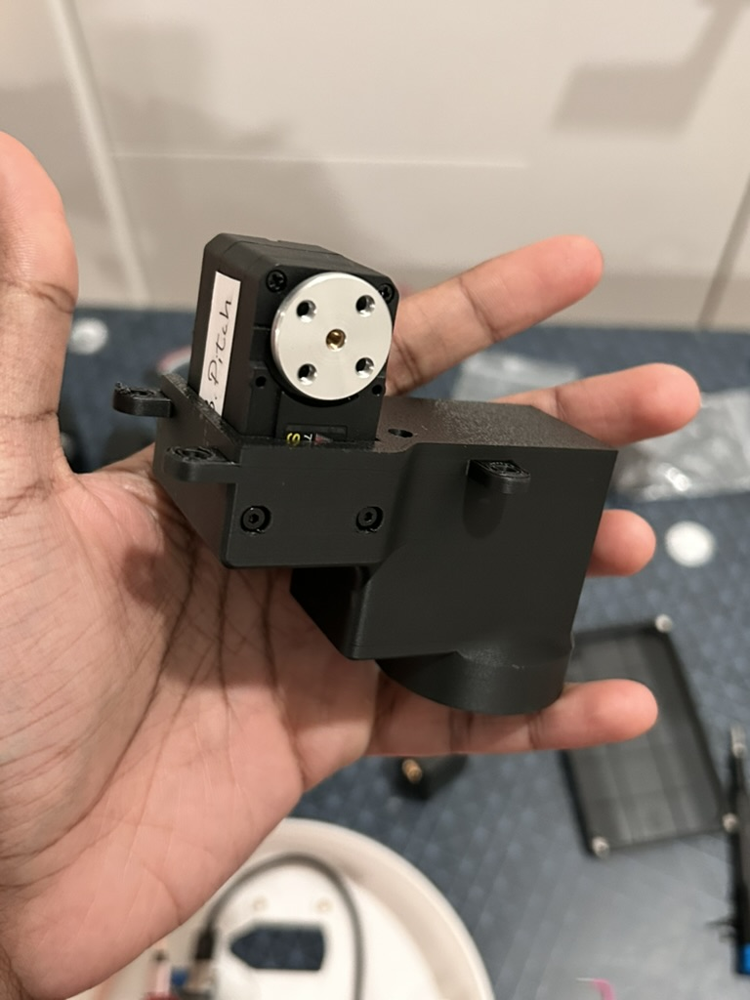</td>
   <td>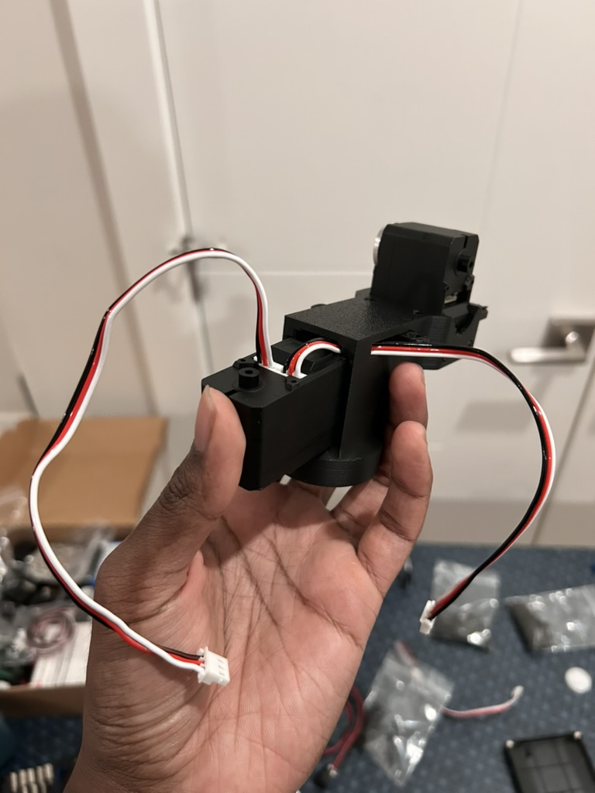</td>
   <td>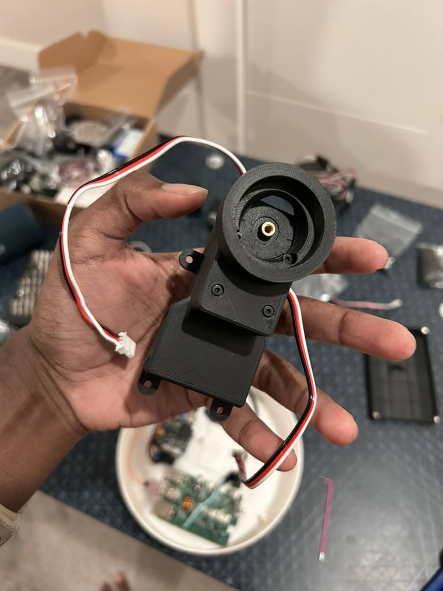</td>
   </tr>
   </table>

1. **Completing the base**

   - Fasten down the core you just assembled into the M3 heatset inserts on the base cover using M3 screws.
   - Tidy up the wiring and make sure it's not too loose
   - Take the panel mount barrel jack and attach it to the bottom base plate, then hold down any extra loop wire with tape. Make sure to have enough slack so that the base is still able to rotate.
   - If you don't have the panel mount socket soldered to a barrel jack wire, do that.

   <table>
   <tr>
   <td>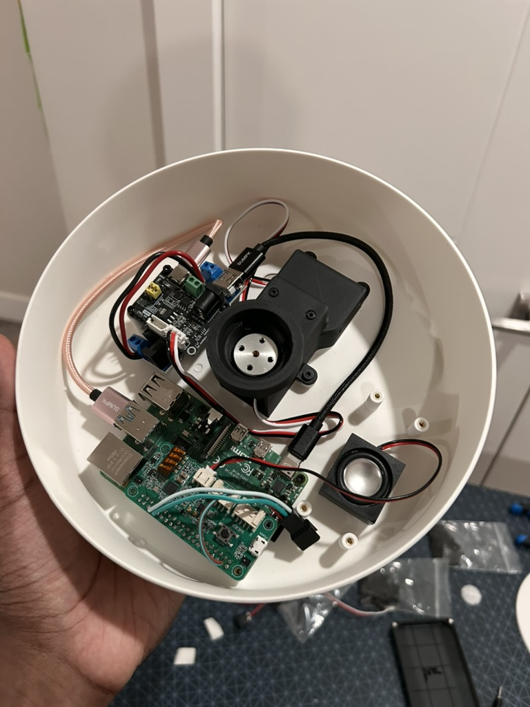</td>
   <td>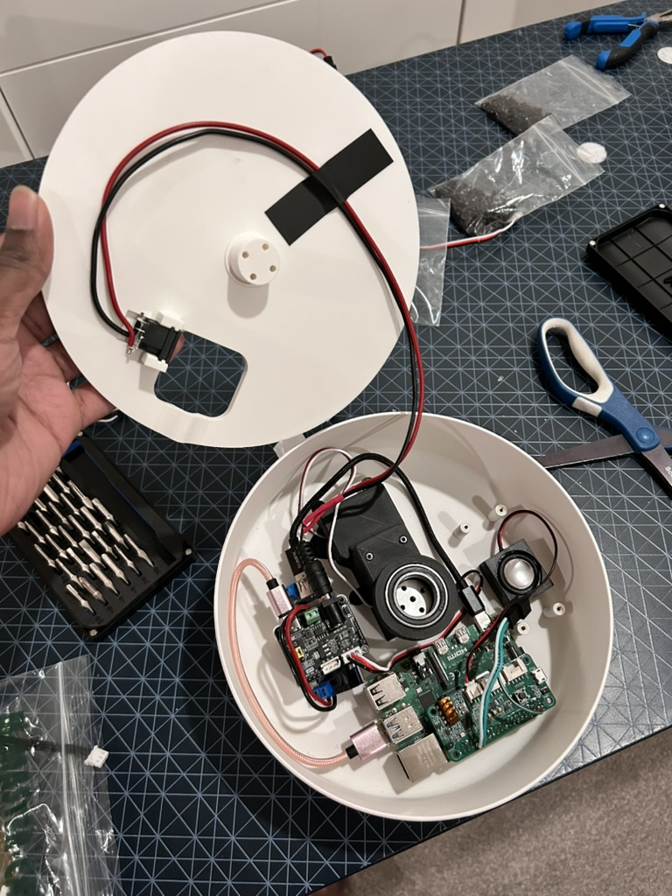</td>
   </tr>
   </table>

1. **Connect the head wiring:**
   - connect jumper wires to the LED wires coming from the base. These wires will be plugging into the ports on the LED array

> ⚠️ _Reminder:_ Double-check all connections before powering on. Incorrect wiring can damage components.

### 2. Assembling LeLamp Body

You can find the 3D model of the robot in [OnShape](https://cad.onshape.com/documents/9550bfca8afe239c9c77175c/w/ef96633be1293d7199c6c822/e/2d4b5fbfb0593cc7c52def2b).

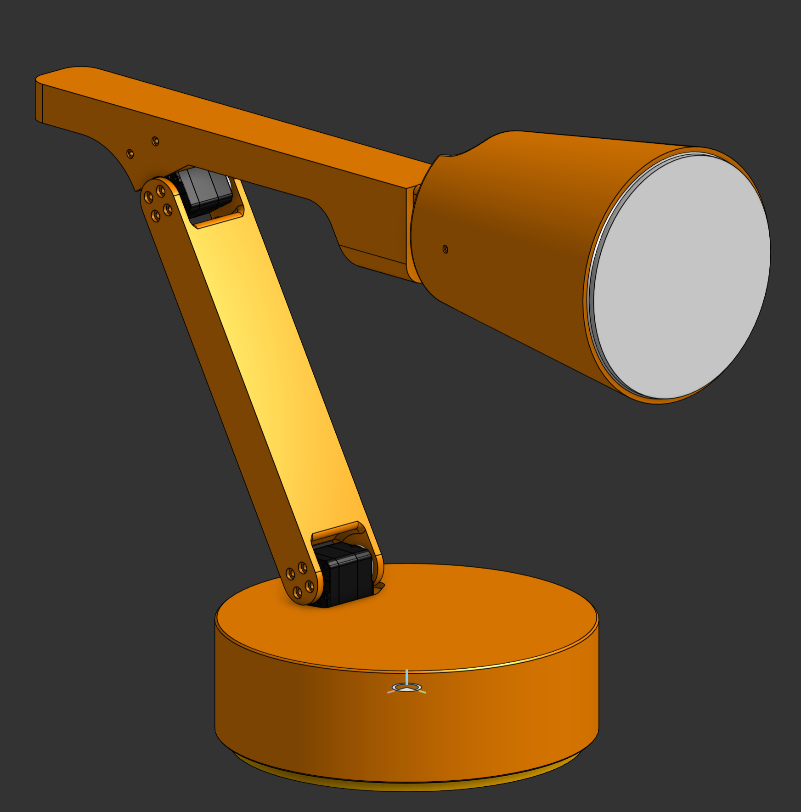

> NOTE: If you will use the LED at the head, remember to route the 3 LED wires together with the motor wires throughout the cabe routes in the lamp's body. This is not shown in the images below.

#### Assembling Link 1

a. Plug the wire for link 1 into the Base Pitch actuator (ID-2)

b. Fasten link 1 to both rotor plates of Base Pitch actuator (ID-2).

c. Route the wire (and the LED wire) through the channel and place the cover on top.

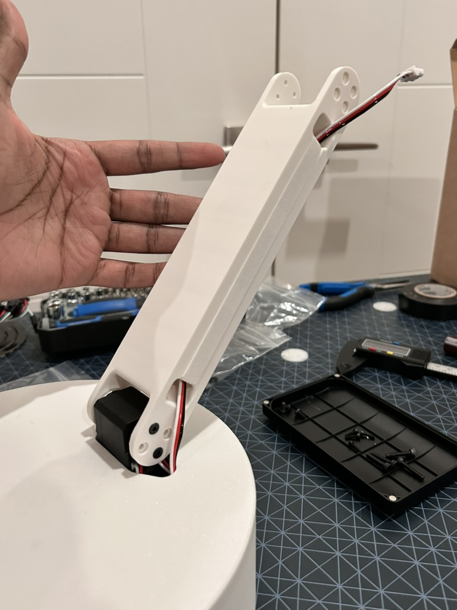

#### Assembling Link 2

a. Plug both wires into the Wrist Roll actuator (ID-4). Then take the long wire (+ the LED wire) and put it through the channel down link 2 and grab it from the other end. Route the shorter wire through the opening at the end of the link.

   <table>
   <tr>
   <td>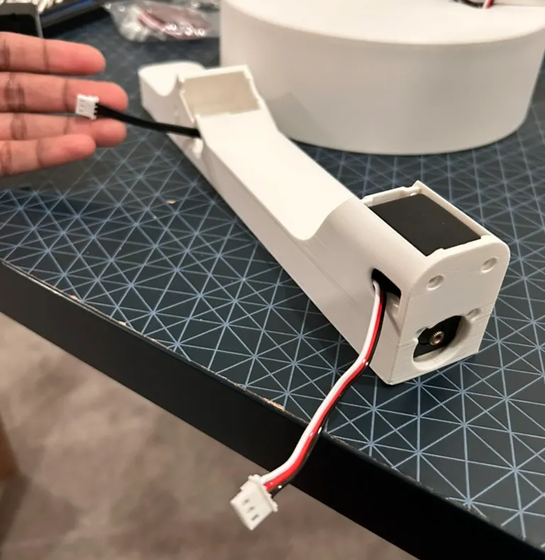</td>
   <td>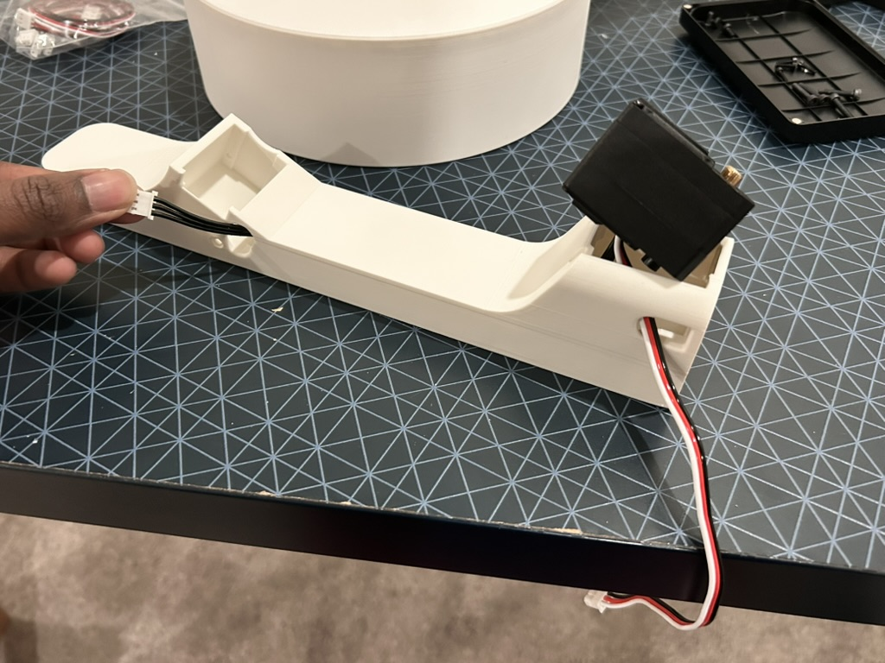</td>
   </tr>
   </table>

b. You have to remove the rotor plate for this. Push the actuator in while pinning down the short wire in the channel designed for it.

   <table>
   <tr>
   <td>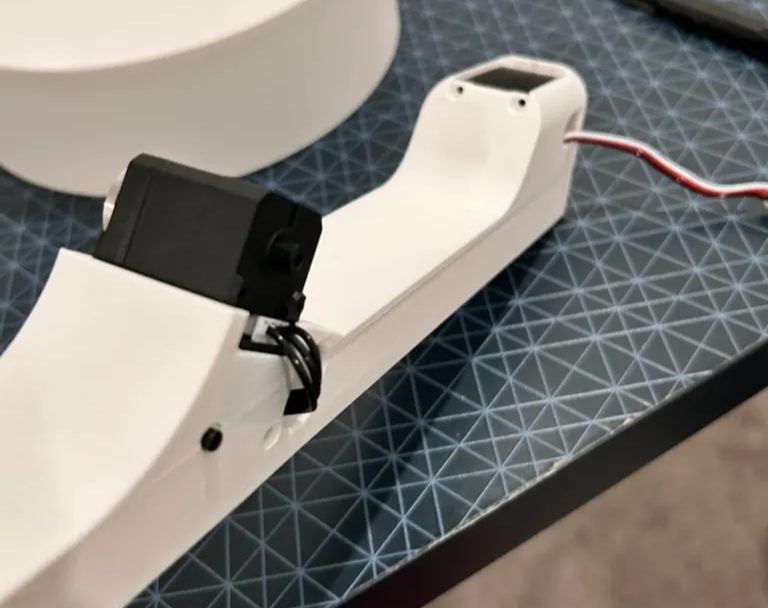</td>
   <td>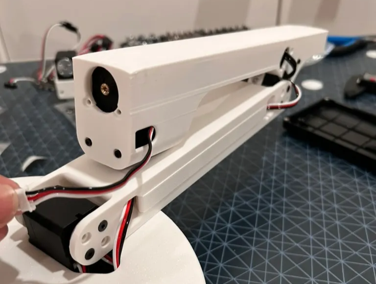</td>
   </tr>
   </table>

c. Once it is snugly in place, and the wire lengths are appropriate you can fasten it down with the M2 screws

d. Then you can slot in the elbow pitch actuator (ID-3), connect the wire to the closer socket and fasten it down.

e. Finally attach the second link to the first at the elbow pitch rotor plate.

#### Assembling Link 3

a. Put on the rotor plate on the wrist roll actuator. Screw into the central hole (to ensure the rotor plate is fixed in place). Then fasten down the 3rd link.

b. Put in the Wrist Pitch actuator (ID-5), wire it up and fasten it to the link.

   <table>
   <tr>
   <td>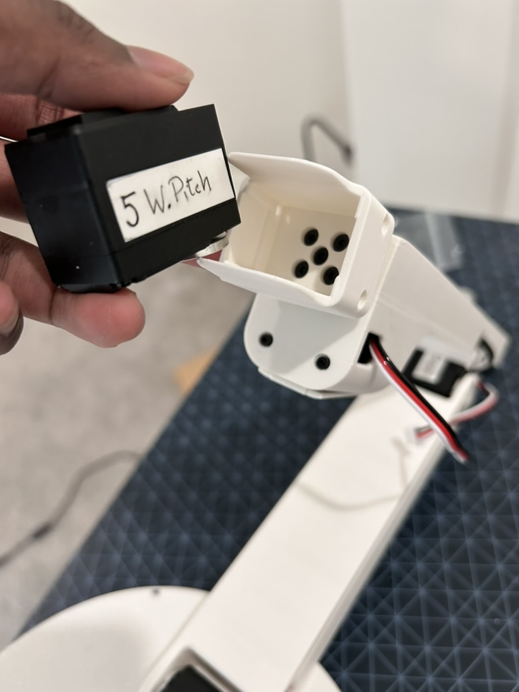</td>
   <td>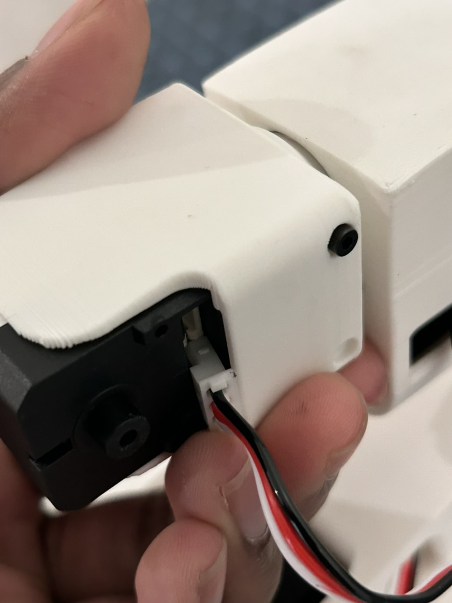</td>
   </tr>
   </table>

## Motor Assembly

Each STS3215 servo motor comes with two motor horns — one with gears and one without. Before mounting the servos onto the lamp structure, first attach the geared horn to the motor’s output side (the side with the copper gear) and secure it firmly with screws. On the opposite side, place the non-geared horn; this one does not need to be screwed in, as it serves only for axis alignment.

Because the motor body is asymmetrical, the orientation of the motor horns is critical to ensure proper movement and reliability. Refer to the reference images below to confirm correct positioning.

Refer to the schematics or the lamp base image above for proper wiring orientation and connection order.

> ⚠️ _Reminder:_ If your motor wire isn't long enough, you have to extend them through another wire by [splicing the wires](https://www.youtube.com/watch?v=r7GlDBge_WU).

### 3. Assembling the LeLamp Head

Connect the LED matrix in the head to the Raspberry Pi hat in the base. The image below shows the general wiring layout:

1. **Connect to the Pi hat:** Use a **female connector** that plugs into the Raspberry Pi hat's LED output pins.

2. **Route the wire:** Run the wire from the base all the way up to the head. You can solder good quality wire in between to extend the connection as needed. Ensure the wire is at least **50 cm** long to reach from the head to the base.

3. **Connect to the LED matrix:** The head comes with preset LED connectors. Simply plug your wire into these connectors as in the image above.

4. **Follow color conventions:**

   - **Black** — GND
   - **Red** — 5V
   - **Yellow** — Data

5. If you're unfamiliar with WS2812B LED wiring, refer to this [tutorial](https://lastminuteengineers.com/ws2812b-arduino-tutorial/).

6. The image above also indicates the **orientation and placement** of the LED matrix inside the head.
7. Finally, push the lamp shade cover (the one that goes in front of the LED) into the lamp shade.

## Power

You'll need 2 power supplies to power LeLamp:

1. **A 5V 2A DC Power Supply With DC Plug**: This is used to provide power to the servos.
2. **A 5V 2A Type C Charger**: This is used to provide power to the Rasperry Pi.

You can reduce the amount of power supply to 1 by providing the 5V from the motor driver to the pi. However, this is not recommended and has high risk of bricking your Pi.

## Assembly Completion Checklist

After completing lamp assembly, verify:

- [ ] All parts are connected
- [ ] An assembled LeLamp

## What You Should Have

At this stage, you should have:

- **Functional head assembly** with all electronics working
- **Proper cable management** with wires routed through head structure

---

**Previous**: [Servo Setup](./2.%20Servos%20Setup.md) | **Next**: [LeLamp Setup](./4.%20LeLamp%20Setup.md)
