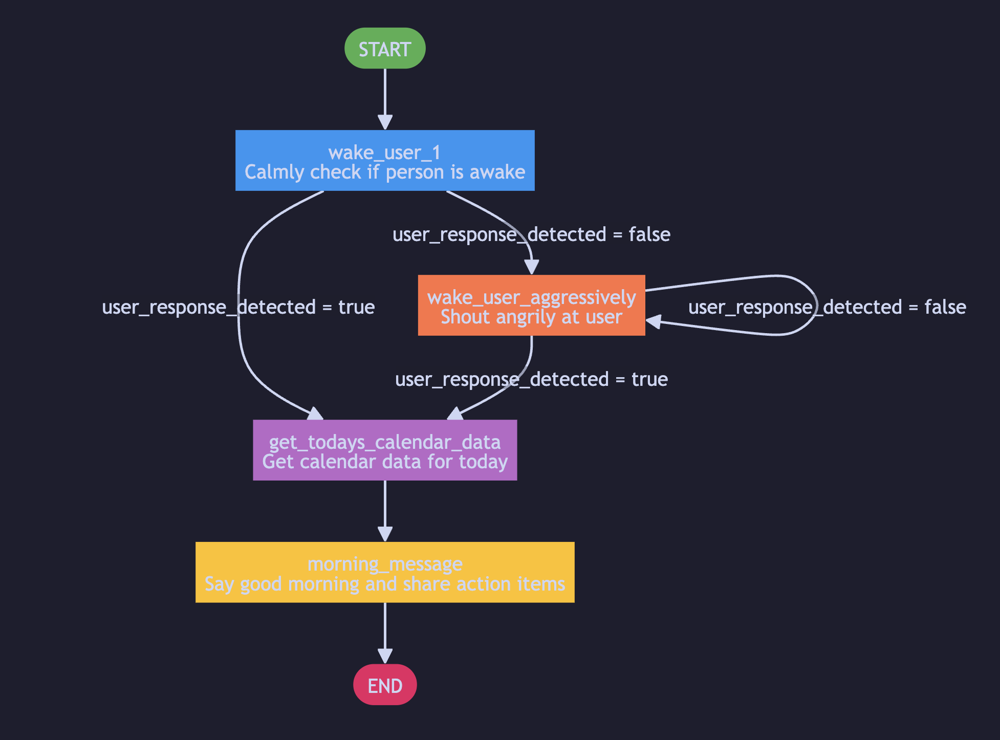

# 🔄 LeLamp Workflows Guide

**🔧 Required tools:** Computer with LeLamp runtime, text editor  
**📦 Required:** LeLamp runtime repository, understanding of Python and JSON

## Overview

Workflows in the LeLamp runtime system enable you to create custom AI-powered behaviors for your robot lamp. Workflows help the robot follow a set of instructions sequentially, essentially forming a graph structure that defines how the robot should respond to different situations and execute tasks.

The LeLamp runtime uses LiveKit AI to process these workflows, allowing your robot to intelligently follow complex instruction sequences and interact with its environment. Let's deconstruct how this works.

## Workflow Structure

In the code, each workflow consists of two essential files:

1. **`workflow.json`** - Defines the workflow structure, nodes, edges, and execution logic
2. **`tools.py`** - Contains the Python functions (tools) that the workflow can call during execution

These files must be placed inside a folder named after your workflow (e.g., `my_custom_workflow/`), which you then upload to the `workflows/` folder in your LeLamp runtime repository.

## Creating a New Workflow

### Step 1: Create Your Workflow Folder

First, navigate to wherever you would like to edit the LeLamp runtime repository

```bash
cd lelamp_runtime
cd workflows
mkdir my_custom_workflow
cd my_custom_workflow
```

Replace `my_custom_workflow` with your desired workflow name. Use lowercase letters, numbers, and underscores only (e.g., `greeting_workflow`, `dance_sequence`, `morning_routine`).

### Step 2: Create `workflow.json`

Create a `workflow.json` file that defines your workflow's graph structure. This file describes:

- **Nodes**: Individual steps or decision points in your workflow, each with an `intent` that describes what the node should accomplish
- **Edges**: Connections between nodes that define the flow, supporting both normal and conditional transitions
- **State Schema**: Defines the workflow's state variables and their types
- **Preferred Actions**: Optional tools that a node can call from `tools.py`

Example `workflow.json` structure (wake up routine):

```json
{
  "id": "wake_up_workflow",
  "name": "Wake Up Routine",
  "description": "A progressive wake-up routine with LeLamp that adapts based on how the user responds",
  "author": "team",
  "createdAt": "2025-11-03T10:00:00Z",
  "state_schema": {
    "user_response_detected": { "type": "boolean", "default": false },
    "attempt_count": { "type": "integer", "default": 0 },
    "calendar_data": { "type": "object", "default": {} }
  },
  "nodes": [
    {
      "id": "wake_user_1",
      "intent": "Calmly and kindly check if the person is awake.",
      "preferred_actions": []
    },
    {
      "id": "wake_user_aggressively",
      "intent": "Shout at the user more angrily and tell them they're worthless and should get up now.",
      "preferred_actions": []
    },
    {
      "id": "get_todays_calendar_data",
      "intent": "Get the calendar data for today for the user.",
      "preferred_actions": ["get_dummy_calendar_data"]
    },
    {
      "id": "morning_message",
      "intent": "Say good morning to the user and tell them what action items they have for the day.",
      "preferred_actions": []
    }
  ],
  "edges": [
    {
      "id": "start",
      "source": "START",
      "target": "wake_user_1",
      "type": "normal"
    },
    {
      "id": "e2",
      "source": "wake_user_1",
      "target": {
        "true": "get_todays_calendar_data",
        "false": "wake_user_aggressively"
      },
      "state_key": "user_response_detected",
      "type": "condition"
    },
    {
      "id": "e4",
      "source": "wake_user_aggressively",
      "target": {
        "true": "get_todays_calendar_data",
        "false": "wake_user_aggressively"
      },
      "state_key": "user_response_detected",
      "type": "condition"
    },
    {
      "id": "e5",
      "source": "get_todays_calendar_data",
      "target": "morning_message",
      "type": "normal"
    },
    {
      "id": "e6",
      "source": "morning_message",
      "target": "END",
      "type": "normal"
    }
  ]
}
```

It might be easier to visualize it like this:



Notice how in some of the "nodes" we don't specify any preferred actions. This is because the AI (our Livekit agent running on OpenAI Realtime) has the ability to decide how to act on its own using its pre-existing tools that we have built (such as expressing its emotion, speaking, or changing the color of the LEDs). If you want the agent to use some more advanced/niche tools (which we highly encourage you to do), these should be defined in the `tools.py` file. .

**Key Concepts:**

- **Nodes** define intents (what should be done) rather than explicit actions, allowing the AI agent to interpret and execute flexibly
- **Edges** can be `"normal"` (direct flow) or `"condition"` (branching based on state)
- **Conditional edges** use `state_key` to check a state variable and `target` as an object with `true`/`false` paths
- **Preferred actions** are tool functions that a node should prefer to use, defined in `tools.py`. If you make custom ones and really want the AI to use it at a certain step in the workflow, you should give its name here.
- **State schema** defines variables that track workflow state across nodes.

### Step 3: Create `tools.py`

Create a `tools.py` file that implements the functions referenced in your `workflow.json`. These functions are the actual tools that your workflow can use. We created an example tool called `get_dummy_calendar_data` that looks like this:

```python
from livekit.agents import function_tool
@function_tool
async def get_dummy_calendar_data(self) -> dict:
    """
    Get the user's calendar data for today. Call this function when you need to see what
    meetings, events, or tasks the user has scheduled for the day. This helps you inform
    them about their daily schedule during the wake-up routine.

    Returns:
        A dictionary containing today's calendar events with titles, start times, and end times.
    """
    print("LeLamp: calling get_dummy_calendar_data function")
    try:
        return {
            "calendar_data": {
                "events": [
                    {
                        "title": "Meeting with John",
                        "start_time": "2025-11-04T10:00:00Z",
                        "end_time": "2025-11-04T11:00:00Z",
                    },
                    {
                        "title": "Hot Yoga Session",
                        "start_time": "2025-11-04T12:00:00Z",
                        "end_time": "2025-11-04T13:00:00Z",
                    },
                ]
            }
        }
    except Exception as e:
        result = f"Error getting dummy calendar data: {str(e)}"
        return {"error": result}
```

You could actually create a better version of this that actually connects to your real Google calendar if you want to, that would be very nice.

**Important Notes:**

- All tool functions must return something that is readable to the LLM, such as a dict, json, or just text.
- All tools must have the parameter `self`, though you can add more parameters (keep in mind that the AI fills these parameters so make sure its something that it would know).
- Use type hints for better code clarity
- Include docstrings explaining what each function does
- Import any necessary runtime modules at the top of the file

## Running Workflows

To make your workflows available when running the LeLamp agent, you need to specify them using the `WORKFLOWS` environment variable.

#### Basic Usage

Run the main workflow script with your workflows enabled:

```bash
WORKFLOWS=workflow_1 sudo uv run main_workflow.py console
```

Replace `workflow_1` with the actual names of your workflow folders (without the path, just the folder name). If you want to enable multiple workflows at once just write `WORKFLOWS=workflow_1, workflow_2" instead.

#### Example

If you have workflows named `greeting_workflow`, `dance_sequence`, and `interactive_mode`, you would run:

```bash
WORKFLOWS=greeting_workflow,dance_sequence,interactive_mode sudo uv run main_workflow.py console
```

**Note:** Ensure all workflow folder names are correct and exist in the `workflows/` directory. If a workflow name is misspelled or doesn't exist, it will be skipped (check the console output for warnings).

### Step 4: Upload Your Workflow

Once you've created both files, your workflow folder structure should look like this:

```
workflows/
└── my_custom_workflow/
    ├── workflow.json
    └── tools.py
```

If you're working on the Raspberry Pi directly, your files are already in place. If you're developing on a separate computer:

1. **Commit and push** your workflow to github
2. Pull the updates using `git pull` when ssh'd into your raspberry pi

## Workflow Best Practices

### 1. Naming Conventions

- Use descriptive, lowercase names with underscores
- Keep names concise but clear (e.g., `voice_control`, `dance_routine`, `mood_lighting`)
- Avoid special characters and spaces

### 2. Error Handling

Always include error handling in your `tools.py` functions:

```python
def my_tool(context: Dict[str, Any]) -> Dict[str, Any]:
    try:
        # Your implementation
        return {**context, "status": "success"}
    except Exception as e:
        return {**context, "status": "error", "error": str(e)}
```

### 3. State

- Remember to define the state_key within edges (such that the AI knows which state the check or update after running a node) and state_schema (such that it can define what states to keep track of from the get go).

An example of a state is `user_response_detected`. If the AI has to "check if the user is awake" at a specific node, then it will recognize this state and update it. Then when at the next edge our backend can detect that this value has been changed to eg. true and will then route the workflow in the right direction (like the diagram above).

### 5. Documentation

- Document your workflow's purpose in `workflow.json`
- Include clear docstrings in all `tools.py` functions
- Comment complex logic in your code
- Also, if your tools.py folder needs a `.env` file or something (eg. if you're connecting to an external service), then write this as a comment at the top of the tools file.

## Troubleshooting

### Workflow Not Found

If you get an error that a workflow is not found:

1. **Check the folder name** - Ensure it matches exactly (case-sensitive)
2. **Verify location** - Confirm the folder is in `lelamp_runtime/workflows/`
3. **Check file names** - Both `workflow.json` and `tools.py` must exist

### Import Errors in `tools.py`

If you encounter import errors:

1. **Check dependencies** - Ensure all imported modules are available in the runtime
2. **Verify paths** - Use relative imports or absolute imports from the runtime root
3. **Test imports** - Try importing your tools module directly:

```bash
cd lelamp_runtime
sudo uv run python -c "from workflows.my_custom_workflow.tools import greet_user"
```

### Workflow Execution Errors

If the workflow runs but fails during execution:

1. **Check console output** - Look for error messages in the terminal
2. **Validate JSON** - Ensure `workflow.json` is valid JSON (use a JSON validator)
3. **Test tools individually** - Import and test each function in `tools.py` separately
4. **Check context** - Verify that state data is being passed correctly between nodes

## Next Steps

- **Explore existing workflows** - Check the `workflows/` folder in the LeLamp runtime repository for examples
- **Share your workflows** - Contribute back to the community by sharing your workflow implementations
- **Read the runtime docs** - Refer to the [LeLamp Runtime repository](https://github.com/humancomputerlab/lelamp_runtime) for advanced features and API documentation

---

**Previous**: [LeLamp Control](./5.%20LeLamp%20Control.md) | **Troubleshooting**: [Common Issues](./6.%20Common%20Issues.md)
